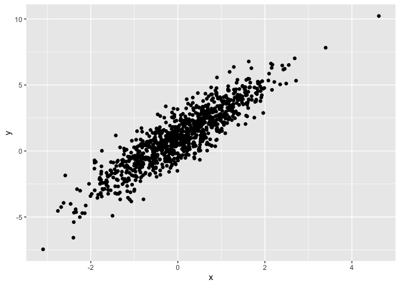
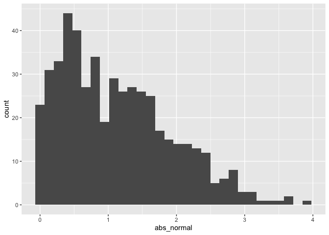

Simple document
================

``` r
library(tidyverse)
```

I’m an R Markdown document!

# Section 1

Here’s a **code chunk** that samples from a *normal distribution*:

``` r
samp = rnorm(100)
length(samp)
```

    ## [1] 100

# Section 2

I can take the mean of the sample, too! The mean is 0.0972241.

# Section 3

This is going to be a plot! Frist I generate a dataframe, then use
ggplot to make a scatterplot.

<!-- -->

## Plot for learning assessment

``` r
library(tidyverse)
plot_df =
  tibble(
    x = rnorm(n=500, mean=1),
    logVar = x > 0,
    abs_normal = abs(x)
  )
ggplot(plot_df, aes(x=abs_normal)) + geom_histogram()
```

    ## `stat_bin()` using `bins = 30`. Pick better value with `binwidth`.

<!-- -->

``` r
median_samp = median(pull(plot_df, x))
```

# Section 4

Cheat Sheet for Text Formatting

## Text formatting

*italic* or *italic* **bold** or **bold** `code` superscript<sup>2</sup>
and subscript<sub>2</sub>

## Headings

# 1st Level Header

## 2nd Level Header

### 3rd Level Header

## Lists

-   Bulleted list item 1

-   Item 2

    -   Item 2a

    -   Item 2b

1.  Numbered list item 1

2.  Item 2. The numbers are incremented automatically in the output.

## Tables

| First Header | Second Header |
|--------------|---------------|
| Content Cell | Content Cell  |
| Content Cell | Content Cell  |
